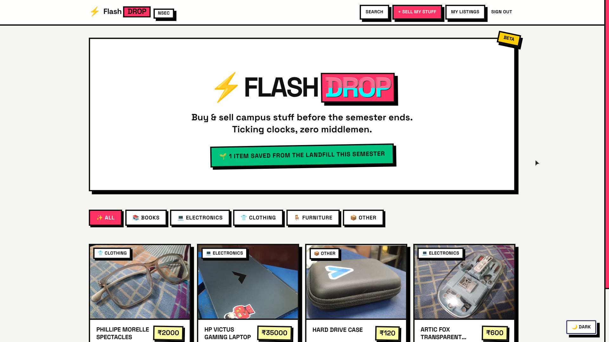
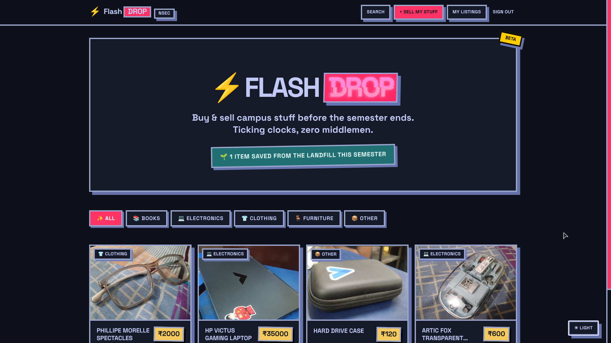
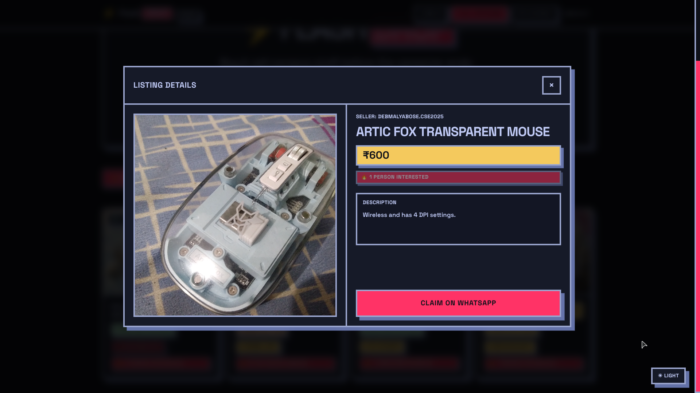
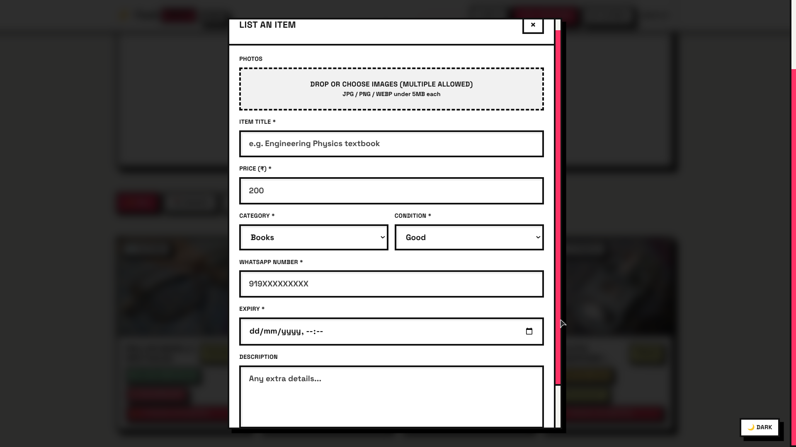

<div align="center">

# ⚡ FlashDrop

### **Live → [https://flashdrop.vercel.app](https://flashdrop.vercel.app)**

A hyper-local, time-limited circular economy marketplace built exclusively for **NSEC students**.  
List. Claim. Repeat — before the clock runs out.

---

**Built for [INnovatrix](https://avenir26.nsec.ac.in) @ Avenir '26 Tech Fest — NSEC, Kolkata**

</div>

---

## 📸 Screenshots

> _Screenshots will be added here_

| Feed (Light Mode) | Feed (Dark Mode) | Item Detail | List an Item |

|  |  |  |  |

---

## 🎯 What is FlashDrop?

FlashDrop is a **campus circular economy marketplace** built for NSEC students to buy and sell second-hand items — textbooks, electronics, clothing, furniture — without middlemen, without clutter, and with a real time pressure.

Every listing has an **expiry clock**. When it runs out, the listing vanishes. This keeps the feed fresh, creates urgency, and means stuff actually moves — rather than rotting in a "Facebook group" forever.

### The Problem It Solves

- Students leave campus every semester with stuff they no longer need
- Campus WhatsApp groups are a mess — no structure, no search, no accountability
- Perfectly good items end up in the trash rather than a new owner's hands

### The Solution

- 🔐 **NSEC-only** — only `@nsec.ac.in` email addresses can list or claim
- ⚡ **Flash listings** — every item has a countdown; urgency drives action
- 💬 **Zero friction claiming** — one tap opens WhatsApp directly to the seller.
- 🌱 **Impact counter** — tracks how many items were saved from the landfill this semester.
- 🔴 **Realtime feed** — new listings appear instantly via Supabase Realtime subscriptions.

---

## 🏗️ Tech Stack

| Layer | Technology | Why |
|---|---|---|
| **Frontend Framework** | React 18 | Fast, component-based, hooks-first |
| **Build Tool** | Vite 5 | Sub-second HMR, ESM native |
| **Styling** | Tailwind CSS v3 + Vanilla CSS | Token-based design system, zero runtime CSS |
| **Backend / Auth** | Supabase (PostgreSQL + Auth + Storage + Realtime) | Magic link auth, row-level security, no backend to manage |
| **Routing** | React Router v6 | File-based client routing with `<Routes>` |
| **Hosting** | Vercel | Zero-config deploys from `main` |
| **Design System** | Neo-Brutalist with Dark Mode | Thick borders, hard shadows, high contrast, glitch logo |

---

## 🗂️ Codebase Structure

```
FlashDrop/
├── index.html                  # Vite entry point
├── vite.config.js              # Vite config (React plugin)
├── tailwind.config.js          # Tailwind tokens (CSS var aliases + custom colors)
├── postcss.config.js
├── vercel.json                 # SPA rewrite rule (all → index.html)
├── .env.example                # Template for required env vars
│
├── scripts/
│   ├── supabase-wave1.sql      # Full DB schema + RLS policies + storage bucket
│   └── verify-supabase.mjs    # One-shot env & DB connectivity check
│
└── src/
    ├── main.jsx                # React root mount
    ├── index.css               # Global design tokens (CSS custom properties + Tailwind layers)
    ├── App.jsx                 # Router + dark mode toggle + theme persistence
    │
    ├── lib/
    │   ├── supabase.js         # Supabase client (env-safe, graceful fallback)
    │   └── itemMedia.js        # Image URL parsing (single / JSON array / plain array)
    │
    ├── hooks/
    │   └── useItems.js         # Data hook: fetch + Realtime subscription + category/search filter
    │
    ├── components/
    │   ├── FlashDropLogo.jsx   # Logo with glitch CSS animation (hero + nav variants)
    │   ├── Navbar.jsx          # Sticky nav — auth-aware, mobile-responsive, opens UploadItemModal
    │   ├── CategoryFilter.jsx  # Brutalist filter pill buttons (All / Books / Electronics / ...)
    │   ├── ItemGrid.jsx        # Responsive grid with loading skeletons
    │   ├── ItemCard.jsx        # Card with condition badge, countdown, FOMO counter, click-to-expand
    │   ├── ListItemModal.jsx   # Item detail + "Claim on WhatsApp" CTA (deep-links wa.me)
    │   ├── UploadItemModal.jsx # Sell form — image upload, validation, Supabase insert
    │   ├── CountdownTimer.jsx  # Live D/H/M/S countdown using setInterval
    │   └── FomoBadge.jsx       # "🔥 N people interested" badge (renders only if count > 0)
    │
    └── pages/
        ├── Home.jsx            # Feed page — hero, category filter, search results, impact counter
        ├── Login.jsx           # Magic link auth (NSEC email gate)
        ├── AuthCallback.jsx    # Handles PKCE code exchange + OTP token verification
        └── MyListings.jsx      # Seller dashboard — mark sold, delete, view own listings
```

---

## 🔄 App Flow

### 1. Browsing (anonymous)
```
User lands on / (Home)
  → useItems() queries Supabase: active, non-expired, non-sold items
  → Realtime channel subscribes to items table changes
  → Items render as ItemCards in the grid
  → User can filter by category or search by keyword (?q=)
  → Clicking a card opens ListItemModal (item detail view)
  → "Claim on WhatsApp" → redirected to /login
```

### 2. Authentication
```
/login
  → User types @nsec.ac.in email
  → supabase.auth.signInWithOtp() sends magic link
  → User clicks link → /auth/callback
  → AuthCallback handles PKCE code or token_hash exchange
  → Session established → redirect to /
```

### 3. Selling
```
Navbar "Sell My Stuff" button (auth required)
  → UploadItemModal opens
  → User fills: title, price, category, condition, WhatsApp number, expiry, images
  → Validation: NSEC email check, price > 0, valid expiry, image < 5MB
  → Images uploaded to Supabase Storage (item-images bucket, user-namespaced)
  → Item row inserted into items table
  → Realtime update fires → all connected clients refresh their feed instantly
```

### 4. Claiming
```
ListItemModal "Claim on WhatsApp"
  → If not logged in: redirect to /login
  → upsert into interest_clicks (item_id, user_id) — deduplicates per user
  → If new row: RPC increment_interest() increments counter atomically
  → window.open(wa.me/{seller_phone}?text=...) — deep-links to WhatsApp
```

### 5. My Listings
```
/my-listings (auth guard — redirects to /login if no session)
  → Fetches all items WHERE seller_id = user.id (including sold/expired)
  → "Mark Sold" → UPDATE items SET is_sold=true WHERE id=? AND seller_id=?
  → "Delete" → DELETE WHERE id=? AND seller_id=?
  → Optimistic UI update on success
```

---

## 🗄️ Database Schema

```sql
items (
  id              UUID PK
  seller_id       UUID → auth.users
  seller_name     TEXT          -- derived from email prefix
  seller_whatsapp TEXT          -- sanitized digits only
  title           TEXT
  description     TEXT
  price           INTEGER
  category        TEXT          -- Books | Electronics | Clothing | Furniture | Other
  condition       TEXT          -- Like New | Good | Fair
  image_url       TEXT          -- single URL or JSON array of URLs
  is_sold         BOOLEAN
  interested_count INTEGER
  expires_at      TIMESTAMPTZ
  created_at      TIMESTAMPTZ
)

interest_clicks (
  item_id  UUID → items
  user_id  UUID → auth.users
  PRIMARY KEY (item_id, user_id)   -- deduplicates per user
)
```

All tables have **Row Level Security (RLS)** enabled:
- Anyone can read active (non-sold, non-expired) items
- Only the seller can update or delete their own listings
- Only authenticated users can insert listings or register interest
- Storage: public read, auth-only upload, user-namespaced delete

---

## 🎨 Design System

FlashDrop uses a **Neo-Brutalist** design language:

| Token | Light | Dark |
|---|---|---|
| Background | `#F4F4F0` (off-white) | `#0F111A` (deep navy) |
| Card | `#FFFFFF` | `#161A28` |
| Border | `#111111` (4px solid) | `#9AA5CE` |
| Shadow | `8px 8px 0px #000` (hard offset) | `8px 8px 0px rgba(108,124,182,0.92)` |
| Accent / CTA | `#FF3366` (flash-pink) | `#FF3366` |
| Price Tag | `#FFFFA5` (yellow) | `#F4C95D` |

- **Font**: Space Grotesk (Google Fonts)
- **Borders**: 4px solid, no radius
- **Shadows**: Hard offset (no blur), translate on hover
- **Logo**: CSS glitch animation with chromatic aberration — CRT scanline variant in dark mode

---

## 🚀 Running Locally

```bash
# 1. Clone
git clone https://github.com/JustJoyful/NSEC-FlashDrop.git
cd NSEC-FlashDrop

# 2. Install dependencies
npm install

# 3. Set up environment
cp .env.example .env.local
# → Fill in VITE_SUPABASE_URL and VITE_SUPABASE_ANON_KEY from your Supabase project

# 4. Run the database schema
# → Copy scripts/supabase-wave1.sql → paste into Supabase SQL Editor → Run

# 5. Start dev server
npm run dev
# → http://localhost:5173
```

### Required Supabase setup
- Enable **Email Magic Links** (Auth → Providers → Email)
- Set **Redirect URL**: `http://localhost:5173/auth/callback` (and your prod URL)
- Enable **Realtime** on the `items` table (Database → Replication → Toggle Insert/Update/Delete)
- The `item-images` storage bucket is created by the SQL script automatically

---

## 📦 Environment Variables

```env
VITE_SUPABASE_URL=https://your-project-id.supabase.co
VITE_SUPABASE_ANON_KEY=your-anon-key

# Optional — used for magic link redirect URL in production
VITE_APP_URL=https://flashdrop.vercel.app
```

---

## 📜 Commit History

| Hash | Date | Description |
|---|---|---|
| `5ef3d7b` | 2026-04-18 | Fixed condition popup and people-interested flash card |
| `ce22a63` | 2026-04-18 | Force Vercel webhook ping |
| `5a37568` | 2026-04-18 | Light-mode hero DROP more readable in pink |
| `4f8228a` | 2026-04-18 | Fixed timer feature with some changes |
| `fd5b9a4` | 2026-04-18 | Feature: Search added |
| `a37f4b8` | 2026-04-18 | Fixed shadows in dark mode |
| `e65c1e9` | 2026-04-18 | Fixed bugs — Login/AuthCallback CSS vars, dark-mode skeletons, ListItemModal nav bug, UploadItemModal keyboard close, savedCount wiring |
| `9afeeb5` | 2026-04-18 | Force Vercel webhook ping |
| `842e627` | 2026-04-18 | UI overhaul with better dark mode colours and animation effects |
| `9bf32c2` | 2026-04-17 | ItemCard hybrid interaction, ListItemModal converted to detail view, UploadItemModal upgraded |
| `c17c452` | 2026-04-17 | Fixed price visibility in dark mode |
| `61ef6f1` | 2026-04-17 | Added dark mode toggle (QoL) |
| `20cc1e6` | 2026-04-17 | Updated Navbar responsive layout |
| `eea9f4a` | 2026-04-17 | Fixed login authentication bug post-deployment |
| `bfe5fcb` | 2026-04-17 | Force initial Vercel build |
| `b15403e` | 2026-04-17 | feat(wave-3): harden auth, seller flow, and Vercel routing |
| `6e353e1` | 2026-04-17 | Initial commit for Hackathon Project — INnovatrix 2 |

---

## 🏆 Hackathon

> **Event**: INnovatrix  
> **Fest**: Avenir '26 Tech Fest  
> **Institution**: Netaji Subhash Engineering College (NSEC), Kolkata  
> **Category**: PS-03 | The Circular Campus Economy         

FlashDrop was designed, architected, and built during the **INnovatrix hackathon** at Avenir '26. The core MVP — auth, listings, realtime feed, WhatsApp claiming, dark mode, and full mobile responsiveness — was shipped within the hackathon window.

---

## 📄 License

MIT — free to fork, adapt, and deploy for your own campus.